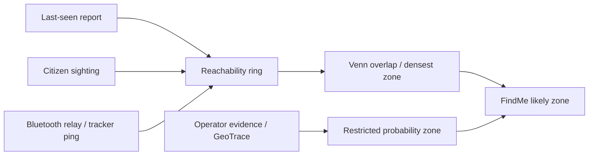

# DeySafe Launch Compliance Crosswalk

Date: 2026-06-06  
Scope: Nigerian public PWA launch readiness, WakaSafe road safety, FindMe, SOS, SHIELD, data, deployment, and corrective actions.

## Release Decision

DeySafe is suitable for a controlled public beta only if it is labeled as a warning and reporting product, not an emergency-dispatch authority. It is not yet suitable for an unrestricted national safety launch that promises rescue, real-time police response, background Bluetooth tracking, or guaranteed broadcast delivery.

The launch posture should be:

1. Warning-only public beta.
2. Demo data off in production.
3. Human verification required before critical public alerts.
4. No promise of armed response or automatic official dispatch.
5. Real-data and operator readiness visible in SHIELD before promotion.

## What We Dropped

| Gap | Root Cause | Corrective Action |
|---|---|---|
| We built features faster than the traveler story | No single day-in-the-life acceptance path | This matrix now makes traveler, family, and operator journeys the acceptance basis |
| WakaSafe looked like a route tool but used corridor/straight-line language | Backend route and frontend map UX were not aligned | `/api/route` now returns road-or-fallback metadata; WakaSafe auto-renders, speaks, and starts Journey Guard from one action |
| PWA installability was incomplete | Service worker was a cache kill-switch | `app/sw.js` now caches the shell and `app/index.html` registers it |
| Place search felt hardcoded | Suggestions were treated like the boundary | `/api/places` now declares open search; free text resolves through geocode/gazetteer |
| Video was discussed but not made a field workflow | Evidence vault was mistaken for citizen camera capture | Report now has camera/video capture metadata; raw upload still needs production object storage |
| Coercion safety was not visible | Silent SOS existed, but there was no quick decoy surface if the phone was inspected | Privacy lock now masks the app as Trip Notes while SOS/route state keeps running |
| "AI works" was too vague | Key-gated AI and rule fallback were not separated | Matrix separates built, key-gated, and proven-live states |
| Bluetooth/mesh was over-implied | Backend registry existed; background scanning needs native app | Keep PWA as relay/intake; native app milestone owns background BLE |
| Railway/Postgres confidence was assumed from Git deploy | Railway auth and production DB gate were not proven in this session | Run `scripts/verify_all.ps1 -Postgres` against Railway or disposable Postgres before release |

## End-to-End Product Story

| User | Day-in-life path | How it works today | Must not claim yet |
|---|---|---|---|
| Traveler | Opens PWA, types current area, hears risk, starts WakaSafe once, gets route map, Journey Guard, foreground warnings, and automatic arrival handling | `app/index.html` calls `/api/risk`, `/api/route`, `/api/journey/start`; map and voice render in browser | Guaranteed safety, guaranteed police response, background app tracking |
| Common citizen not traveling | Checks local area, reports danger anonymously, reads community updates, uses police-misconduct category | `/api/risk`, `/api/report`, `/api/channel`, human-gated review | That every report is true or immediately verified |
| Person in danger | Uses silent/audible SOS, trusted-circle path, share location manually, server stores durable SOS | `/api/sos`, trusted contacts, offline outbox, owner-facing redacted status | Automatic emergency service dispatch |
| Family of missing person | Opens FindMe case, shares flyer, receives sightings, sees triangulated likely zone | `/api/missing`, `/api/sighting`, client-side triangulation, map layers | Exact locator guarantee |
| SHIELD operator | Reviews queue, verifies/dismisses, opens case, records evidence/geotrace, monitors ops readiness | `app/review.html`, `/api/queue`, `/api/verify`, `/api/cases`, `/api/evidence`, `/api/ops-readiness` | That the operator network is already staffed nationwide |

## Compliance Matrix

| Capability | Status | Where Implemented | Connection / Data Flow | Evidence | Corrective Action |
|---|---|---|---|---|---|
| PWA install on phones/desktops | Implemented | `app/manifest.json`, `app/sw.js`, `app/index.html` install button | Browser sees manifest + service worker; Android/desktop gets install prompt; iOS uses Safari Share -> Add to Home Screen | `validate_product.py` PWA checks | Add native app later for background BLE/push |
| Offline shell and offline queue | Implemented | `app/sw.js`, outbox logic in `app/index.html` | Shell caches; reports/SOS/sightings queue locally and flush online; APIs remain network-first | `validate_product.py`, existing offline logic | Add background sync where supported |
| WakaSafe road route UX | Implemented with fallback | `engine/api.py` `/api/route`, `road_route_waypoints`, `route_scan_between`, `app/index.html` `checkRoute` | From/to -> geocode -> OSRM-compatible road route if available -> segment risk -> auto map + voice | `validate_product.py` route check | Move to contracted routing provider or self-host OSRM for SLA |
| Automatic Journey Guard | Implemented foreground | `app/index.html` `checkRoute`, `startJourneyGuard`, `startJourneyAutoWatch`, `/api/journey/start`, `/api/journey/ping`, `/api/journey/arrive` | Start WakaSafe -> creates guarded journey -> foreground GPS watcher pings privately and marks arrival near destination | `validate_product.py` UI markers + journey API checks | Native app needed for reliable background check-ins |
| WakaSafe corridor fallback | Implemented | `engine/routing.py`, `route_scan_between` | If road provider fails, ordered corridor waypoints are scored and labeled as fallback | Gate disables external routing for deterministic tests | Keep label explicit; do not hide fallback as road |
| Nigeria-wide place input | Partial but improved | `/api/places`, `/api/geocode`, `/api/gazetteer`, datalist attachers | Suggestions are not the boundary; user can type any place; geocoder resolves or asks for better location | `validate_product.py` open-search check | Import full LGA/ward/settlement dataset and aliases |
| Area safety report | Implemented | `/api/risk`, `showArea`, `riskAtClient` | Type place or locate-me -> radius risk -> map circle -> voice summary | Existing gates + UI behavior | Add confidence labels by data source |
| Proactive warnings | Implemented foreground | `toggleWatch`, `checkProximity`, `proWarn` | Browser watchPosition compares GPS locally to public incidents; speaks one warning per new danger | Client code; privacy bright line | Native/background push later |
| Voice throughout app | Implemented progressive enhancement | `speak`, `sayArea`, `sayRoute`, `startVoice`, `handleVoice`, `nlMic` | Web Speech reads area/route/SOS and accepts place/route/report dictation when supported | Browser markers; existing tests | Add non-English prompt packs and accessibility QA |
| Anonymous danger reports | Implemented | `/api/report`, `postOrQueue`, review queue | User report -> geocode -> candidate/human-review signal -> operator verification before high alert | `validate.py` | Add reporter reputation and OTP option without exposing identity |
| Police accountability | Implemented basic | `TYPES`, rights card, `/api/report` | Police-misconduct type enters same human-gated queue | UI + API type | Add legal-aid partner escalation and redaction training |
| SOS durable event | Implemented partial response | `/api/sos`, trusted circle, outbox, `sosActivate` | Client creates event, prepares shareable location, notifies configured channels when available | `validate_response.py` | Prove real SMS/WhatsApp delivery before public emergency claim |
| Trusted circle | Implemented | `/api/trusted`, local owner token, `trusted_contacts` | Contacts stored locally and mirrored server-side; SOS can reference them | Existing response gate | Add contact verification and delivery receipt |
| FindMe cases | Implemented | `/api/missing`, `/api/sighting`, `openCase`, map layers | Missing report -> case -> sightings -> search radius and public flyer | `validate.py` | Add consent workflow and case-team roles for real families |
| Venn / triangulation | Implemented in browser | `triangulate` in `app/index.html` | Last seen + sightings become reachability rings; densest overlap becomes likely zone | UI behavior and TRACEABILITY | Treat as probability zone, not exact locator |
| Movement prediction | Implemented heuristic | `triangulate`, direction text | Sighting trail/direction creates forward cone marker | TRACEABILITY | Replace with road/terrain model after pilot data |
| Bluetooth / mesh | Backend registry only | `beaconsign.py`, `/api/beacon-relay`, `/api/mesh/devices`, `/api/trackers` | Signed beacon/relay records can become sightings; consent-scoped devices tracked in SHIELD | `validate_product.py` mesh/tracker checks | Native app required for background BLE scanning |
| Camera/video evidence | Partial, visible to field user | `app/index.html` `rMedia`, `mediaMetaFromInput`, `/api/report`, `/api/evidence`, SHIELD case workspace | Field user can capture image/video and attach file metadata/hash to anonymous report; restricted evidence vault handles operator records | `validate_product.py` report media metadata + evidence vault checks | Add raw object storage, upload auth, retention, and chain-of-custody file custody |
| Coercion-safe privacy lock | Implemented client-side | `app/index.html` `panicLock`, `decoy`, silent SOS auto-lock | Hides DeySafe behind Trip Notes while underlying SOS/route state remains active | `validate_product.py` decoy markers | Native secure lock/PIN later; do not market as tamper-proof |
| GeoTrace | Implemented restricted | `/api/geotrace`, `geotrace_annotations` | Evidence -> analyst probability zone -> restricted case aid | `validate_product.py` | Keep public copy redacted; never present as exact location |
| AI extraction/intake | Built, key-gated | `engine/ai.py`, `/api/intake`, `/api/ingest-live` | Key present -> LLM extracts; no key -> rules/fallback | `validate.py`, `/api/ai-status` | Set real keys and run live Railway proof |
| Real public data | Partial | `engine/ingest.py`, `/api/ingest-live`, sample seed | Public RSS/live pull enters queue; demo seed exists for local visibility | Existing gates | Production must set `DEMO_MODE=0`; add source health dashboard |
| Broadcast reach | Partial/key-gated | `broadcast.py`, `sms.py`, `/api/sms`, `/api/ussd` | Inbound SMS/USSD works; outbound depends on provider credentials | `validate_response.py` | Add Africa's Talking, WhatsApp Business, Web Push, delivery receipts |
| Postgres/Railway | Implemented in code, production proof pending | `engine/db.py`, `Procfile`, `scripts/verify_all.ps1` | `DATABASE_URL` selects Postgres; Railway deploys from Git | Postgres gate exists | Run against Railway/disposable Postgres before launch; Railway CLI login needed locally |
| Operator console | Implemented | `app/review.html`, operator endpoints | Queue -> verify/dismiss -> cases/evidence/readiness | Product gate | Staff operators and define SLA |
| Privacy/safety bright lines | Implemented and documented | Public projections, redaction, auth gates, docs | Public reads hide restricted fields; high-impact actions operator-gated | `validate_security.py`, `validate_product.py` | NDPA retention/erasure policy still needed |

## PWA Install Instructions

Android Chrome:
1. Open the DeySafe URL.
2. Tap the in-app Install button if shown, or Chrome menu -> Install app / Add to Home screen.
3. DeySafe opens like an app and keeps the shell available offline.

iPhone Safari:
1. Open the DeySafe URL in Safari.
2. Tap Share.
3. Tap Add to Home Screen.
4. DeySafe opens from the home screen. iOS does not expose the same install prompt event as Android.

Desktop Chrome or Edge:
1. Open the DeySafe URL.
2. Use the browser install icon or the in-app Install button.
3. Pin it to the taskbar/dock if desired.

App stores are not required for this PWA. App stores become necessary for background Bluetooth scanning, deeper push behavior, richer camera capture, and stronger background location controls.

## Triangulation / Mesh Model

The public app should say "likely zone" or "search area." It should never say "exact location" unless an authorized family/responder view has a verified exact coordinate and consent/legal basis.

## Launch Gates Before Public Promotion

| Gate | Required Setting / Command | Pass Criteria |
|---|---|---|
| No fake safety data | `DEMO_MODE=0` in Railway | `/api/health` shows `"demo": false` |
| Operator auth | `OPERATOR_TOKEN` or `DEYSAFE_OPERATORS` set | `/api/queue` unauthenticated returns 401 |
| Postgres persistence | `DATABASE_URL` set; run `scripts/verify_all.ps1 -Postgres -DatabaseUrl "<url>"` | Health reports `database.backend == "postgres"` and all gates pass |
| Broadcast honesty | `DEYSAFE_BROADCAST_SIM=1` for tests; real provider keys only after approval | Test mode never pretends delivery; production records provider receipts |
| Road routing | `DEYSAFE_ROAD_ROUTING=1`; optional `DEYSAFE_ROAD_ROUTING_URL` | `/api/route?from=Abuja&to=Kaduna` returns `route_mode` and waypoints |
| PWA install | Serve over HTTPS | Browser shows install path; shell reloads after offline visit |
| Real-data proof | Pull live feeds and review queue | No critical alert goes public without human verification |
| Public wording | README/app copy | Says warning-only beta; no rescue guarantee |

## Product Gaps We Should Add Next

1. Public camera/video raw upload storage with upload limits, chain-of-custody file custody, and redacted preview.
2. Full Nigeria location dataset: 774 LGAs, wards, aliases, markets, motor parks, schools, checkpoints, roads, and community corrections.
3. Web Push plus SMS/WhatsApp delivery receipts for verified alerts and SOS trusted-circle notifications.
4. Native app for background BLE, push-to-talk, offline packs, camera workflow, and safer background location.
5. School and motor-park safety modules: parent broadcast, closure/reopening, driver/union alerts, checkpoint status.
6. Responder directory and SLA: vetted clinics, road safety groups, legal aid, family liaisons, audit trail.
7. NDPA retention and deletion workflow for real missing-person/SOS/evidence data.
8. Source reputation and false-positive review dashboard for operators.

## Definition Of Done Going Forward

A feature is done only when all four are true:

1. It is visible in the user journey or operator workflow.
2. It has a backend contract and real data path.
3. It is represented in this matrix or `docs/TRACEABILITY.md`.
4. It has a gate in `validate.py`, `validate_response.py`, `validate_security.py`, `validate_quality.py`, or `validate_product.py`.
