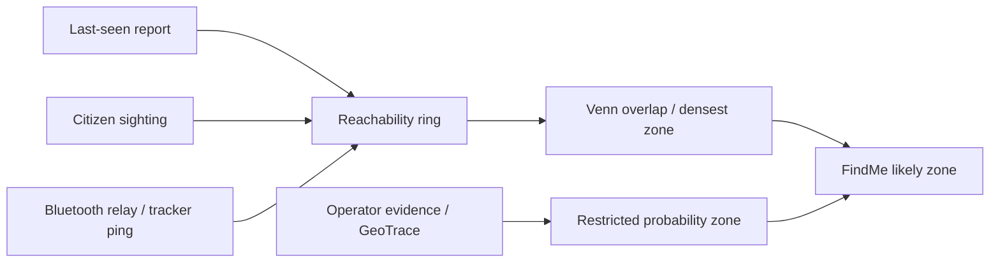

# DeySafe Launch Compliance Crosswalk

Date: 2026-06-07
Scope: Nigerian public PWA launch readiness, WakaSafe road safety, FindMe, SOS, SHIELD, data, deployment, and corrective actions.

## 2026-06-07 Corrective-Action Update

The following previously partial/not-done software gaps are now implemented in
the repo and covered by gates:

| Gap | New status | Evidence |
|---|---|---|
| Full Nigeria location dataset | Implemented offline baseline | `scripts/import_nigeria_gazetteer.py`, `config/nigeria_admin_places.json`, `engine/gazetteer.py`, `/api/places`, `/api/place-suggest`, `validate_product.py` |
| Google/live place suggestions | Implemented key-gated path | `GOOGLE_PLACES_API_KEY` / `GOOGLE_MAPS_API_KEY`, `/api/place-suggest`; offline gazetteer remains active without Google |
| Safety Vault encryption at rest | Implemented for new guardian records | `engine/identity.py` vault cipher helpers, `guardian_contacts.address_ciphertext`, redacted public projections |
| Guardian verification | Implemented beta flow | `/api/vault/guardians/verify`, Profile verify action, `validate_personal_beta.py` |
| Secure browser session path | Implemented cookie support | `/api/signup/verify` sets HttpOnly `ds_session`; `_session_token` accepts cookie; PWA stops persisting bearer token to localStorage |
| Server-side stale checks | Implemented automatic worker option | `DEYSAFE_SAFETY_TICK_MINUTES`, `/api/health` `safety_tick`, `/api/source-health` `safety_tick` |
| NDPA retention workflow | Implemented operator dry-run/apply control | `/api/retention`, SHIELD Privacy retention card, conservative DB retention plan |
| Launch/provider readiness | Implemented cross-check endpoint | `/api/launch-readiness` summarizes provider keys, Postgres, gazetteer, retention, scheduler, safety tick |
| Nigerian language selector | Improved | Critical SOS/readiness/profile phrases now react to English, Nigerian Pidgin, Hausa, Yoruba, and Igbo profile choices |

Still outside the web repo: native background BLE/hardware activation, staffed
nationwide field operations, real video frame AI, and live provider/Railway proof
with production secrets.

## Release Decision

DeySafe is suitable for a controlled public beta only if it is labeled as a warning and reporting product, not an emergency-dispatch authority. It is not yet suitable for an unrestricted national safety launch that promises rescue, real-time police response, background Bluetooth tracking, or guaranteed broadcast delivery.

The launch posture should be:

1. Warning-only public beta.
2. Demo data off in production.
3. Human verification required before critical public alerts.
4. No promise of armed response or automatic official dispatch.
5. Real-data and operator readiness visible in SHIELD before promotion.

## What We Dropped

| Gap | Root Cause | Corrective Action |
|---|---|---|
| We built features faster than the traveler story | No single day-in-the-life acceptance path | This matrix now makes traveler, family, and operator journeys the acceptance basis |
| WakaSafe looked like a route tool but used corridor/straight-line language | Backend route and frontend map UX were not aligned | `/api/route` now returns road-or-fallback metadata; WakaSafe auto-renders, speaks, and starts Journey Guard from one action |
| PWA installability was incomplete | Service worker was a cache kill-switch | `app/sw.js` now caches the shell and `app/index.html` registers it |
| Place search felt hardcoded | Suggestions were treated like the boundary | `/api/places` now declares open search; free text resolves through geocode/gazetteer |
| Video was discussed but not made a field workflow | Evidence vault was mistaken for citizen camera capture | Report now has camera/video capture metadata; raw upload still needs production object storage |
| Coercion safety was not visible | Silent SOS existed, but there was no quick decoy surface if the phone was inspected | Privacy lock now masks the app as Trip Notes while SOS/route state keeps running, and the lock PERSISTS across reload/reopen (`localStorage ds_locked`) so a reopened phone stays disguised |
| "AI works" was too vague | Key-gated AI and rule fallback were not separated | Matrix separates built, key-gated, and proven-live states |
| Bluetooth/mesh was over-implied | Backend registry existed; background scanning needs native app | Keep PWA as relay/intake; native app milestone owns background BLE |
| Railway/Postgres confidence was assumed from Git deploy | Railway auth and production DB gate were not proven in this session | Run `scripts/verify_all.ps1 -Postgres` against Railway or disposable Postgres before release |
| API contract drift made the UI look fake | A later branch merge replaced the stronger API while the PWA still called newer endpoints | Restored the hardened API behavior, re-added `/api/media/presign` and richer Journey Guard endpoints, and gated the contract in `validate_product.py` |
| Work was hard to find | Branches, chat notes, generated files, and backup files blurred together | Added `docs/WORK_INDEX.md`, fixed `.gitignore`, added `.env.example`, and removed runtime artifacts from Git tracking |
| Hostile-device safety was under-modeled | We treated SOS closure and guardian contacts like normal app settings | Added phone OTP sessions, server-side Safety Vault, Safety/Duress PINs, PIN-gated SOS closure, and a validation gate for stolen-phone denial paths |
| Browser alerts were implied before proof | PWA push permission, subscription, test, and receipt confirmation were not separated | Added Web Push config/register/test/confirm contracts and service-worker notification handling; production still needs VAPID/provider proof |
| Daily-use routes were not first-class | WakaSafe was trip-by-trip, not a daily safety habit | Added MySafe saved places and recurring routes tied to verified sessions |

## End-to-End Product Story

| User | Day-in-life path | How it works today | Must not claim yet |
|---|---|---|---|
| Traveler | Opens PWA, types current area, hears risk, starts WakaSafe once, gets route map, Journey Guard, foreground warnings, and automatic arrival handling | `app/index.html` calls `/api/risk`, `/api/route`, `/api/journey/start`; map and voice render in browser | Guaranteed safety, guaranteed police response, background app tracking |
| Common citizen not traveling | Checks local area, reports danger anonymously, reads community updates, uses police-misconduct category | `/api/risk`, `/api/report`, `/api/channel`, human-gated review | That every report is true or immediately verified |
| Person in danger | Uses silent/audible SOS, Safety Vault guardian path, share location manually, server stores durable SOS, Safety PIN requests closure, Duress PIN hides locally while escalation remains active | `/api/sos`, `/api/vault/guardians`, `/api/profile/pins`, offline outbox, owner-facing redacted status | Automatic emergency service dispatch |
| Family of missing person | Opens FindMe case, shares flyer, receives sightings, sees triangulated likely zone | `/api/missing`, `/api/sighting`, `/api/triangulate` (server `engine/triangulate.py`), map layers | Exact locator guarantee |
| Person attending a risky meeting | Starts SafeMeet, phone foreground-watches arrival, records check-ins, and flags anomalies | `app/index.html` SafeMeet view + `/api/safemeet/start`, `/api/safemeet/checkin`, `/api/safemeet/end` | Background tracking without native app |
| SHIELD operator | Reviews queue, verifies/dismisses, opens case, records evidence/geotrace, monitors ops readiness | `app/review.html`, `/api/queue`, `/api/verify`, `/api/cases`, `/api/evidence`, `/api/ops-readiness` | That the operator network is already staffed nationwide |

## Compliance Matrix

| Capability | Status | Where Implemented | Connection / Data Flow | Evidence | Corrective Action |
|---|---|---|---|---|---|
| PWA install on phones/desktops | Implemented | `app/manifest.json`, `app/sw.js`, `app/index.html` install button, `app/assets/brand/` icons | Browser sees manifest + service worker + DeySafe install icons; Android/desktop gets install prompt; iOS uses Safari Share -> Add to Home Screen | `validate_product.py` PWA/branding checks | Add native app later for background BLE/push |
| Phone OTP account/session | Implemented for beta | `engine/identity.py`, `engine/db.py`, `/api/signup/start`, `/api/signup/verify`, `app/index.html` Profile | Phone -> OTP challenge -> verified citizen user -> signed session token -> Profile unlocks Vault/PINs/push/MySafe | `validate_personal_beta.py` account/session checks | Move session to HttpOnly cookie/native secure storage when app stack matures |
| Safety Vault guardians | Implemented server-side, redacted client | `guardian_contacts` tables, `/api/vault/guardians`, Profile Safety Vault UI, SOS policy ID flow | Guardian PII is stored server-side and returned as redacted projections only; the browser no longer uses `ds_trusted` localStorage or posts contact arrays | `validate_personal_beta.py` no-local-PII + redaction checks | Add contact OTP verification and guardian acceptance workflow |
| Safety/Duress PINs | Implemented | `user_pins` table, `/api/profile/pins`, `/api/sos` cancel transitions, Profile PIN UI | Safety PIN -> `CLOSE_REQUESTED`; Duress PIN -> `DURESS_CONFIRMED` while the phone shows local closure | `validate_personal_beta.py` SOS closure and duress checks | Native secure enclave/biometric step-up later |
| Web Push alert proof | Implemented contract + service worker | `/api/push/config`, `/api/push/register`, `/api/push/test`, `/api/push/confirm`, `app/sw.js` push handlers, Profile push UI | Browser permission/subscription -> server registration -> local/provider test -> user confirms visible receipt; app does not claim ready until confirmation | `validate_personal_beta.py`; `validate_product.py` markers | Configure VAPID keys and delivery receipt storage for production |
| MySafe daily places/routes | Implemented | `mysafe_places`, `mysafe_routes`, `/api/mysafe/places`, `/api/mysafe/routes`, WakaSafe MySafe UI | Verified user saves aliases and recurring routes; WakaSafe remains open to any typed Nigeria location | `validate_personal_beta.py` MySafe checks | Add scheduled proactive journey prompts and route templates |
| Server-side stale timers | Implemented | `engine/safetytick.py`, `/api/safety-tick`, `active_journeys`, `active_safemeets` | Operator/cron tick marks stale or overdue Journey/SafeMeet sessions even when the phone disappears | `validate_personal_beta.py` safety-tick check | Add Railway cron/worker schedule and alert fan-out |
| Offline shell and offline queue | Implemented | `app/sw.js`, outbox logic in `app/index.html` | Shell caches; reports/SOS/sightings queue locally and flush online; APIs remain network-first | `validate_product.py`, existing offline logic | Add background sync where supported |
| WakaSafe road route UX | Implemented with fallback (cached + retry) | `engine/api.py` `/api/route`, `road_route_waypoints`, `_ROUTE_CACHE`/`_route_cache_put`, `route_scan_between`, `app/index.html` `checkRoute` | From/to -> geocode -> OSRM-compatible road route if available -> segment risk -> auto map + voice. Successful roads are now cached in-process (bounded, ~11 m endpoint key) and a single short retry rides out the flaky public OSRM demo, so a common corridor keeps drawing the REAL road instead of dropping to the straight-line corridor; a miss still falls back, never fails closed | `road_route_waypoints` (one retry, then corridor) + `_ROUTE_CACHE` (bounded 512); `validate_product.py` route check | Move to contracted routing provider or self-host OSRM for SLA |
| Automatic Journey Guard | Implemented foreground · first-class + visible · Verified 2026-06-06 (live) | `app/index.html` `checkRoute`, `startJourneyGuard`, `startJourneyAutoWatch`, `renderJourneyBanner`/`#journeyBanner`, `restoreJourney`, `/api/journey/start`, `/api/journey/ping`, `/api/journey/arrive` | Start WakaSafe -> guarded journey -> foreground GPS watcher pings privately and marks arrival; a persistent banner now shows the active trip on EVERY screen (tap -> WakaSafe) and `restoreJourney` re-shows the guard after a reload. Stays automatic — no manual check-in buttons | `#journeyBanner` + `renderJourneyBanner` (on every render), `restoreJourney` called at boot from `ds_journey_id`; `validate_product.py` UI + journey API checks | Native app needed for reliable background check-ins |
| WakaSafe corridor fallback | Implemented | `engine/routing.py`, `route_scan_between` | If road provider fails, ordered corridor waypoints are scored and labeled as fallback | Gate disables external routing for deterministic tests | Keep label explicit; do not hide fallback as road |
| Nigeria-wide place input | Partial but improved | `/api/places`, `/api/geocode`, `/api/gazetteer`, datalist attachers | Suggestions are not the boundary; user can type any place; geocoder resolves or asks for better location | `validate_product.py` open-search check | Import full LGA/ward/settlement dataset and aliases |
| Area safety report | Implemented | `/api/risk`, `showArea`, `riskAtClient` | Type place or locate-me -> radius risk -> map circle -> voice summary | Existing gates + UI behavior | Add confidence labels by data source |
| Proactive warnings | Implemented foreground | `toggleWatch`, `checkProximity`, `proWarn` | Browser watchPosition compares GPS locally to public incidents; speaks one warning per new danger | Client code; privacy bright line | Native/background push later |
| Voice throughout app | Implemented progressive enhancement | `speak`, `sayArea`, `sayRoute`, `startVoice`, `handleVoice`, `nlMic` | Web Speech reads area/route/SOS and accepts place/route/report dictation when supported | Browser markers; existing tests | Add non-English prompt packs and accessibility QA |
| Anonymous danger reports | Implemented | `/api/report`, `postOrQueue`, review queue | User report -> geocode -> candidate/human-review signal -> operator verification before high alert | `validate.py` | Add reporter reputation and OTP option without exposing identity |
| Classifier precision (DATA-05) | Implemented · Verified 2026-06-06 (live) | `engine/geoparse.py` (`detect_type`, `_WEAK_TERMS`, `_STRONG`, `_NEG`/`_neg_categories`, `_SUPPRESS_RE`, `_MISSING_PERSON_RE`) | Free text -> incident type only on a word-boundary STRONG danger term, with weak/ambiguous keywords demoted and dominant non-emergency context (politics/economics/sport/entertainment/legal) suppressed unless a real violence/abduction verb overrides; missing_person additionally gated on person-missing/abduction phrasing | `geoparse.py` self-test: live-RSS junk (tomato prices, party primaries, anniversaries, court appeals, sport metaphors) suppressed while real incidents + every `sample_signals.json` demo entry still detect; `validate*.py` gates | Tune weak/strong lists from operator false-positive review; add non-English coverage |
| Police accountability | Implemented basic | `TYPES`, rights card, `/api/report` | Police-misconduct type enters same human-gated queue | UI + API type | Add legal-aid partner escalation and redaction training |
| SOS durable event | Implemented partial response + hostile-device closure | `/api/sos`, Safety Vault policy, outbox, `sosActivate`, `sosStop` | Client creates event, prepares shareable location, queues Vault guardians when available, and requires Safety/Duress PIN for closure transitions | `validate_response.py`, `validate_personal_beta.py` | Prove real SMS/WhatsApp delivery before public emergency claim |
| Legacy trusted circle endpoint | Deprecated/demo-only | `/api/trusted`, `/api/vault/guardians` | Non-demo clients must use verified session Safety Vault; old local contact mirror is blocked outside demo | `validate_personal_beta.py` static no-local-PII checks | Remove legacy endpoint after migration window |
| FindMe cases | Implemented | `/api/missing`, `/api/sighting`, `openCase`, map layers | Missing report -> case -> sightings -> search radius and public flyer | `validate.py` | Add consent workflow and case-team roles for real families |
| Venn / triangulation | Implemented (server-side) · Verified 2026-06-06 (live) | `engine/triangulate.py` (`search_zones`), `engine/api.py` `GET /api/triangulate`, `app/index.html` `drawBackendTriangulation` | Last-seen + sightings -> server reachability rings -> densest Venn overlap = priority zone; frontend overlays the authoritative zone with `confidence` (0..1) + disclaimer + 🎯 marker | Pure, deterministic engine with self-test; `/api/triangulate` returns ranked zones + `confidence` + `disclaimer` (never "exact"); `drawBackendTriangulation` renders it; `validate*.py` gates | Keep as probability zone, never exact locator (enforced: no "exact" in payload) |
| Movement prediction | Implemented (server-side) | `engine/triangulate.py` `_movement_cone` returned by `/api/triangulate`; `app/index.html` `drawBackendTriangulation` draws the cone polygon | Freshest sighting leg -> forward heading cone + predicted-ahead point in the server result; frontend renders the wedge + spoken heading | `triangulate.py` self-test (cone reads newest leg, capped length); rendered via `drawBackendTriangulation` | Replace with road/terrain model after pilot data |
| Bluetooth / mesh | Backend registry only | `beaconsign.py`, `/api/beacon-relay`, `/api/mesh/devices`, `/api/trackers` | Signed beacon/relay records can become sightings; consent-scoped devices tracked in SHIELD | `validate_product.py` mesh/tracker checks | Native app required for background BLE scanning |
| Camera/video evidence | Implemented metadata + key-gated raw upload + visible AI triage front-door | `app/index.html` `rMedia`, `aiMedia`, `mediaMetaFromFileInput`, `uploadEvidenceIfAny`, `analyzeEvidence`, `/api/media/presign`, `/api/media/analyze`, `/api/report`, `/api/evidence`, SHIELD case workspace | Field user can capture image/video and attach file metadata/hash to anonymous report; home screen can run evidence triage on file facts + written context; with Cloudflare R2 keys and bucket CORS, raw evidence uploads directly to object storage | `validate_product.py` report media metadata + R2 presign + AI evidence review + evidence vault checks | Configure R2 env vars/CORS; add retention and chain-of-custody file custody; wire a real vision adapter before claiming pixel/frame analysis |
| SafeMeet high-risk meeting workflow | Implemented foreground | `app/index.html` `v-meet`/`startMeetWatch`; `/api/safemeet/start`, `/api/safemeet/checkin`, `/api/safemeet/list`, `/api/safemeet/session`, `/api/safemeet/end`, `/api/safemeet/invite`; `engine/safety.py`; `engine/db.py` | Start session -> resolve meeting place -> risk score -> foreground watcher auto-checks arrival and periodic pings -> server stores state/anomaly flags -> owner can complete session | `validate_product.py` SafeMeet gates | Native app needed for reliable background tracking and stronger duress controls |
| Work index and repo hygiene | Implemented | `docs/WORK_INDEX.md`, `.gitignore`, `.env.example` | The repo now lists branches, recovered work, files, proof gaps, and env keys; runtime `.env`/DB/pycache/backup files are removed from Git tracking | `validate_product.py` hygiene checks + Git status | Keep future branch merges gated before push |
| Coercion-safe privacy lock / kill switch | Implemented client-side (persists) · Verified 2026-06-06 (live) | `app/index.html` `panicLock`/`panicUnlock` (`localStorage ds_locked`), boot restore, `decoy`, silent SOS auto-lock | Hides DeySafe behind Trip Notes while underlying SOS/route state remains active; lock now PERSISTS across reload/reopen via `ds_locked` and is re-applied on app boot (was cosmetic before — a reopen previously revealed the real app) | `panicLock` sets `localStorage ds_locked='1'`, boot re-locks if set, covert 4-tap `panicUnlock` clears it; `validate_product.py` decoy markers | Native secure lock/PIN later; do not market as tamper-proof |
| GeoTrace | Implemented restricted | `/api/geotrace`, `geotrace_annotations` | Evidence -> analyst probability zone -> restricted case aid | `validate_product.py` | Keep public copy redacted; never present as exact location |
| AI extraction/intake/evidence triage | Built, key-gated for text; honest no-vision flag for media | `engine/ai.py`, `/api/intake`, `/api/ingest-live`, `/api/media/analyze` | Key present -> LLM extracts text/news/context; no key -> rules/fallback; media endpoint does custody + context triage and returns `vision_ready=false` until a vision adapter exists | `validate.py`, `/api/ai-status`, `validate_product.py` media analyze gate | Set real keys and run live Railway proof; wire a real vision provider before public vision claims |
| Real public data | Partial | `engine/ingest.py`, `/api/ingest-live`, sample seed | Public RSS/live pull enters queue; demo seed exists for local visibility | Existing gates | Production must set `DEMO_MODE=0`; add source health dashboard |
| Broadcast reach (outbound delivery) | Provider layer built · key-gated (needs keys to go live) | `engine/broadcast.py` (`send`/`fan_out`), `engine/sms.py`, `/api/sms`, `/api/ussd` | Inbound SMS/USSD works; outbound now has a real multi-channel provider layer — Africa's Talking SMS, WhatsApp Cloud API, OneSignal push — fanned out per channel. Each channel performs a REAL send only when its keys are present; with no key it returns `unconfigured` and never fakes delivery. `DEYSAFE_BROADCAST_SIM=1` gives an explicitly-flagged SIM path for tests | `broadcast.py` self-test (SIM delivers all channels flagged sim=1; no-key degrades to `unconfigured`); `validate_response.py` | Set real provider keys (AT_USERNAME/AT_API_KEY, WHATSAPP_*, ONESIGNAL_*) + wire delivery-receipt persistence before any public delivery claim |
| Postgres/Railway | Implemented in code, production proof pending | `engine/db.py`, `Procfile`, `scripts/verify_all.ps1` | `DATABASE_URL` selects Postgres; Railway deploys from Git | Postgres gate exists | Run against Railway/disposable Postgres before launch; Railway CLI login needed locally |
| Operator console | Implemented | `app/review.html`, operator endpoints | Queue -> verify/dismiss -> cases/evidence/readiness | Product gate | Staff operators and define SLA |
| Privacy/safety bright lines | Implemented and documented | Public projections, redaction, auth gates, docs | Public reads hide restricted fields; high-impact actions operator-gated | `validate_security.py`, `validate_product.py` | NDPA retention/erasure policy still needed |

## PWA Install Instructions

Android Chrome:
1. Open the DeySafe URL.
2. Tap the in-app Install button if shown, or Chrome menu -> Install app / Add to Home screen.
3. DeySafe opens like an app and keeps the shell available offline.

iPhone Safari:
1. Open the DeySafe URL in Safari.
2. Tap Share.
3. Tap Add to Home Screen.
4. DeySafe opens from the home screen. iOS does not expose the same install prompt event as Android.

Desktop Chrome or Edge:
1. Open the DeySafe URL.
2. Use the browser install icon or the in-app Install button.
3. Pin it to the taskbar/dock if desired.

App stores are not required for this PWA. App stores become necessary for background Bluetooth scanning, deeper push behavior, richer camera capture, and stronger background location controls.

## Triangulation / Mesh Model

The public app should say "likely zone" or "search area." It should never say "exact location" unless an authorized family/responder view has a verified exact coordinate and consent/legal basis.

## Launch Gates Before Public Promotion

| Gate | Required Setting / Command | Pass Criteria |
|---|---|---|
| No fake safety data | `DEMO_MODE=0` in Railway | `/api/health` shows `"demo": false` |
| Operator auth | `OPERATOR_TOKEN` or `DEYSAFE_OPERATORS` set | `/api/queue` unauthenticated returns 401 |
| Postgres persistence | `DATABASE_URL` set; run `scripts/verify_all.ps1 -Postgres -DatabaseUrl "<url>"` | Health reports `database.backend == "postgres"` and all gates pass |
| Broadcast honesty | `DEYSAFE_BROADCAST_SIM=1` for tests; real provider keys only after approval | Test mode never pretends delivery; production records provider receipts |
| Road routing | `DEYSAFE_ROAD_ROUTING=1`; optional `DEYSAFE_ROAD_ROUTING_URL` | `/api/route?from=Abuja&to=Kaduna` returns `route_mode` and waypoints |
| PWA install | Serve over HTTPS | Browser shows install path; shell reloads after offline visit |
| Real-data proof | Pull live feeds and review queue | No critical alert goes public without human verification |
| Public wording | README/app copy | Says warning-only beta; no rescue guarantee |
| Report-burst abuse | NAT-safe content-aware dup throttle in `engine/api.py` (`_duplicate_report_throttled`, `_content_signature`); per-IP request capping deliberately avoided so genuine mass-reporting during an attack is never silenced | A repeated near-identical report from one caller is 429'd while DISTINCT reports from the same carrier-grade-NAT IP always pass |
| Cloudflare R2 evidence storage | Add `CLOUDFLARE_R2_*` / `R2_*` env vars and bucket CORS allowing browser `PUT` from the Railway origin | `/api/media/presign` returns configured upload URL; report evidence stores `object_key` and fingerprint |

## Product Gaps We Should Add Next

1. Cloudflare R2 production proof: bucket CORS, upload limits, chain-of-custody file custody, retention, and redacted preview.
2. Full Nigeria location dataset: 774 LGAs, wards, aliases, markets, motor parks, schools, checkpoints, roads, and community corrections.
3. Web Push plus SMS/WhatsApp delivery receipts for verified alerts and SOS Safety Vault notifications.
4. Native app for background BLE, push-to-talk, offline packs, camera workflow, and safer background location.
5. School and motor-park safety modules: parent broadcast, closure/reopening, driver/union alerts, checkpoint status.
6. Responder directory and SLA: vetted clinics, road safety groups, legal aid, family liaisons, audit trail.
7. NDPA retention and deletion workflow for real missing-person/SOS/evidence data.
8. Source reputation and false-positive review dashboard for operators.

## Definition Of Done Going Forward

A feature is done only when all four are true:

1. It is visible in the user journey or operator workflow.
2. It has a backend contract and real data path.
3. It is represented in this matrix or `docs/TRACEABILITY.md`.
4. It has a gate in `validate.py`, `validate_response.py`, `validate_security.py`, `validate_quality.py`, or `validate_product.py`.
